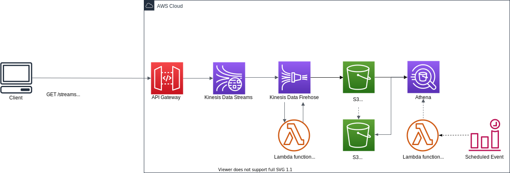

# Web Log Analytics with Amazon Kinesis Data Streams Proxy using Amazon API Gateway

This repository provides you cdk scripts and sample code on how to implement a simple [web analytics](https://en.wikipedia.org/wiki/Web_analytics) system. 
Below diagram shows what we are implementing.

| Example | Architecture Diagram | Tags |
|---------|----------------------|------|
| [Web Log Analytics System with Parquet data format](./web-analytics-parquet) |  | Amazon API Gateway, Amazon Kinesis Data Streams, Amazon Data Firehose, Amazon S3 + Parquet, Amazon Athena, AWS Lambda, Amazon Event Bridge |
| [Web Log Analytics System with Apache Iceberg table](./web-analytics-iceberg) |  | Amazon API Gateway, Amazon Kinesis Data Streams, Amazon Data Firehose, Amazon S3 + Apache Iceberg, Amazon Athena, AWS Lambda |
| [Web Log Analytics System using API Gateway integrated with Data Firehose with Apache Iceberg table](./web-analytics-datafirehose-iceberg) |  | Amazon API Gateway, Amazon Data Firehose, Amazon S3 + Apache Iceberg, Amazon Athena, AWS Lambda |

## Security

See [CONTRIBUTING](CONTRIBUTING.md#security-issue-notifications) for more information.

## License

This library is licensed under the MIT-0 License. See the LICENSE file.

