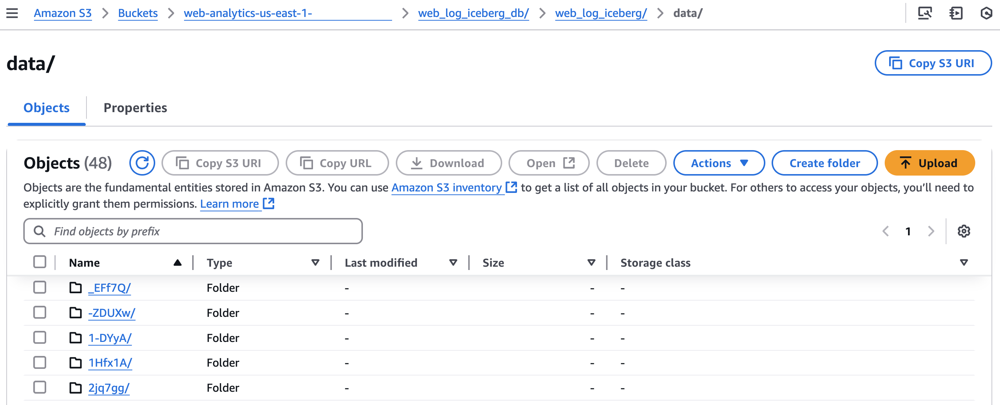
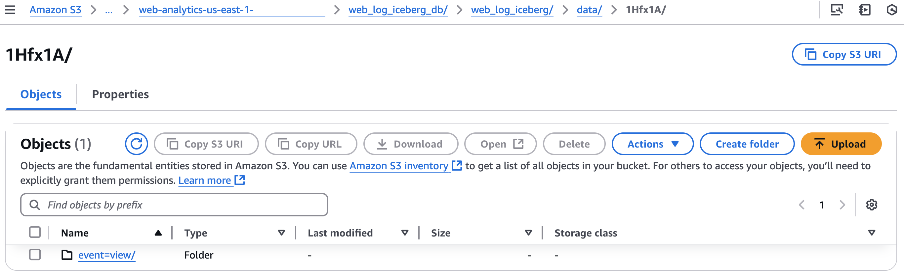

# Web Log Analytics with Amazon Kinesis Data Streams Proxy using Amazon API Gateway

This repository provides you cdk scripts and sample code on how to implement a simple [web analytics](https://en.wikipedia.org/wiki/Web_analytics) system.<br/>
Below diagram shows what we are implementing.


The `cdk.json` file tells the CDK Toolkit how to execute your app.

This project is set up like a standard Python project.  The initialization
process also creates a virtualenv within this project, stored under the `.venv`
directory.  To create the virtualenv it assumes that there is a `python3`
(or `python` for Windows) executable in your path with access to the `venv`
package. If for any reason the automatic creation of the virtualenv fails,
you can create the virtualenv manually.

To manually create a virtualenv on MacOS and Linux:

```
$ python3 -m venv .venv
```

After the init process completes and the virtualenv is created, you can use the following
step to activate your virtualenv.

```
$ source .venv/bin/activate
```

If you are a Windows platform, you would activate the virtualenv like this:

```
% .venv\Scripts\activate.bat
```

Once the virtualenv is activated, you can install the required dependencies.

```
(.venv) $ pip install -r requirements.txt
```

To add additional dependencies, for example other CDK libraries, just add
them to your `setup.py` file and rerun the `pip install -r requirements.txt`
command.

### Upload Lambda Layer code

Before deployment, you should uplad zipped code files to s3 like this:
<pre>
(.venv) $ aws s3api create-bucket --bucket <i>your-s3-bucket-name-for-lambda-layer-code</i> --region <i>region-name</i>
(.venv) $ ./build-aws-lambda-layer-package.sh <i>your-s3-bucket-name-for-lambda-layer-code</i>
</pre>

> :warning: To create a bucket outside of the `us-east-1` region, `aws s3api create-bucket` command requires the appropriate **LocationConstraint** to be specified in order to create the bucket in the desired region. For more information, see these [examples](https://awscli.amazonaws.com/v2/documentation/api/latest/reference/s3api/create-bucket.html#examples).

> :warning: Make sure you have **Docker** installed.

For example,
<pre>
(.venv) $ aws s3api create-bucket --bucket lambda-layer-resources --region <i>us-east-1</i>
(.venv) $ ./build-aws-lambda-layer-package.sh lambda-layer-resources
</pre>

For more information about how to create a package for Amazon Lambda Layer, see [here](https://aws.amazon.com/premiumsupport/knowledge-center/lambda-layer-simulated-docker/).

### Deploy

Before to synthesize the CloudFormation template for this code, you should update `cdk.context.json` file.<br/>
In particular, you need to fill the s3 location of the previously created lambda lay codes.

For example,
<pre>
{
  "firehose_data_tranform_lambda": {
    "s3_bucket_name": "<i>lambda-layer-resources</i>",
    "s3_object_key": "<i>var/fastavro-lib.zip</i>"
  },
  "data_firehose_configuration": {
    "buffering_hints": {
      "interval_in_seconds": 60,
      "size_in_mbs": 128
    },
    "transform_records_with_aws_lambda": {
      "buffer_size": 3,
      "buffer_interval": 300,
      "number_of_retries": 3
    },
    "destination_iceberg_table_configuration": {
      "database_name": "web_log_iceberg_db",
      "table_name": "web_log_iceberg"
    },
    "output_prefix": "web_log_iceberg_db/web_log_iceberg",
    "error_output_prefix": "error/year=!{timestamp:yyyy}/month=!{timestamp:MM}/day=!{timestamp:dd}/hour=!{timestamp:HH}/!{firehose:error-output-type}"
  }
}
</pre>
:information_source: `database_name`, and `table_name` of `data_firehose_configuration.destination_iceberg_table_configuration` is used in [**Set up Delivery Stream**](#set-up-delivery-stream) step.

:information_source: When updating or deleting records in an Iceberg table, specify the table's primary key column name as `unique_keys` in the `data_firehose_configuration.destination_iceberg_table_configuration` settings.
For example,
<pre>
"destination_iceberg_table_configuration": {
  "database_name": "web_log_iceberg_db",
  "table_name": "web_log_iceberg",
  "unique_keys": [
    "user_id", "timestamp"
  ]
}
</pre>


Now you are ready to synthesize the CloudFormation template for this code.<br/>

<pre>
(.venv) $ export CDK_DEFAULT_ACCOUNT=$(aws sts get-caller-identity --query Account --output text)
(.venv) $ export CDK_DEFAULT_REGION=$(aws configure get region)
(.venv) $ cdk synth --all
</pre>

Now let's try to deploy.

## List all CDK Stacks

```
(.venv) $ cdk list
WebAnalyticsKdsProxyApiGw
WebAnalyticsKinesisStream
WebAnalyticsDataFirehoseToIcebergS3Path
WebAnalyticsFirehoseDataTransformLambdaStack
WebAnalyticsFirehoseToIcebergRoleStack
WebAnalyticsGrantLFPermissionsOnFirehoseRole
WebAnalyticsFirehoseToIcebergStack
```

Use `cdk deploy` command to create the stack shown above.

## Create API endpoint for web data collection

<pre>
(.venv) $ cdk deploy --require-approval never \
              WebAnalyticsKdsProxyApiGw \
              WebAnalyticsKinesisStream
</pre>

## Set up Delivery Stream

1. Create a S3 bucket for Apache Iceberg table
   <pre>
   (.venv) $ cdk deploy --require-approval never WebAnalyticsDataFirehoseToIcebergS3Path
   </pre>
2. Create a table with partitioned data in Amazon Athena

   Go to [Athena](https://console.aws.amazon.com/athena/home) on the AWS Management console.<br/>
   * (step 1) Create a database

      In order to create a new database called `web_log_iceberg_db`, enter the following statement in the Athena query editor and click the **Run** button to execute the query.

      <pre>
      CREATE DATABASE IF NOT EXISTS web_log_iceberg_db;
      </pre>

   * (step 2) Create a table

      Copy the following query into the Athena query editor.

      Update `LOCATION` to your S3 bucket name and execute the query to create a new table.
      <pre>
      CREATE TABLE web_log_iceberg_db.web_log_iceberg (
        `user_id` string,
        `session_id` string,
        `event` string,
        `referrer` string,
        `user_agent` string,
        `ip` string,
        `hostname` string,
        `os` string,
        `timestamp` timestamp,
        `uri` string
      )
      PARTITIONED BY (event)
      LOCATION 's3://web-analytics-<i>{region}</i>-</i>{account_id}</i>/web_log_iceberg_db/web_log_iceberg'
      TBLPROPERTIES (
        'table_type'='iceberg',
        'format'='parquet',
        'write_compression'='snappy',
        'optimize_rewrite_delete_file_threshold'='10'
      );
      </pre>
      If the query is successful, a table named `web_log_iceberg` is created and displayed on the left panel under the **Tables** section.

      If you get an error, check if (a) you have updated the `LOCATION` to the correct S3 bucket name, (b) you have `web_log_iceberg_db` selected under the Database dropdown, and (c) you have `AwsDataCatalog` selected as the **Data source**.
3. Create a lambda function to process the streaming data.
   <pre>
   (.venv) $ cdk deploy --require-approval never WebAnalyticsFirehoseDataTransformLambdaStack
   </pre>
4. To allow Data Firehose to ingest data into the Apache Iceberg table, create an IAM role and grant permissions to the role.
   <pre>
   (.venv) $ cdk deploy --require-approval never \
                 WebAnalyticsFirehoseToIcebergRoleStack \
                 WebAnalyticsGrantLFPermissionsOnFirehoseRole
   </pre>

   :information_source: If you fail to create the table, give Athena users access permissions on `web_log_iceberg_db` through [AWS Lake Formation](https://console.aws.amazon.com/lakeformation/home), or you can grant Amazon Data Firehose to access `web_log_iceberg_db` by running the following command:
   <pre>
   (.venv) $ aws lakeformation grant-permissions \
                 --principal DataLakePrincipalIdentifier=arn:aws:iam::<i>{account-id}</i>:role/<i>role-id</i> \
                 --permissions CREATE_TABLE DESCRIBE ALTER DROP \
                 --resource '{ "Database": { "Name": "<i>web_log_iceberg_db</i>" } }'
   (.venv) $ aws lakeformation grant-permissions \
                 --principal DataLakePrincipalIdentifier=arn:aws:iam::<i>{account-id}</i>:role/<i>role-id</i> \
                 --permissions SELECT DESCRIBE ALTER INSERT DELETE DROP \
                 --resource '{ "Table": {"DatabaseName": "<i>web_log_iceberg_db</i>", "TableWildcard": {}} }'
   </pre>
5. Deploy Amazon Data Firehose.
   <pre>
   (.venv) $ cdk deploy --require-approval never WebAnalyticsFirehoseToIcebergStack
   </pre>

## Run Test

1. Run `GET /streams` method to invoke `ListStreams` in Kinesis
   <pre>
   $ curl -X GET https://<i>your-api-gateway-id</i>.execute-api.us-east-1.amazonaws.com/v1/streams
   </pre>

   The response is:
   <pre>
   {
     "HasMoreStreams": false,
     "StreamNames": [
       "PUT-Firehose-aEhWz"
     ],
     "StreamSummaries": [
       {
         "StreamARN": "arn:aws:kinesis:us-east-1:123456789012:stream/PUT-Firehose-aEhWz",
         "StreamCreationTimestamp": 1661612556,
         "StreamModeDetails": {
           "StreamMode": "ON_DEMAND"
         },
         "StreamName": "PUT-Firehose-aEhWz",
         "StreamStatus": "ACTIVE"
       }
     ]
   }
   </pre>

2. Generate test data.
   <pre>
   (.venv) $ pip install -r requirements-dev.txt
   (.venv) $ python src/utils/gen_fake_data.py --max-count 5 --stream-name <i>PUT-Firehose-aEhWz</i> --api-url 'https://<i>your-api-gateway-id</i>.execute-api.us-east-1.amazonaws.com/v1' --api-method records
   [200 OK] {"EncryptionType":"KMS","FailedRecordCount":0,"Records":[{"SequenceNumber":"49633315260289903462649185194773668901646666226496176178","ShardId":"shardId-000000000003"}]}
   [200 OK] {"EncryptionType":"KMS","FailedRecordCount":0,"Records":[{"SequenceNumber":"49633315260289903462649185194774877827466280924390359090","ShardId":"shardId-000000000003"}]}
   [200 OK] {"EncryptionType":"KMS","FailedRecordCount":0,"Records":[{"SequenceNumber":"49633315260223001227053593325351479598467950537766600706","ShardId":"shardId-000000000000"}]}
   [200 OK] {"EncryptionType":"KMS","FailedRecordCount":0,"Records":[{"SequenceNumber":"49633315260245301972252123948494224242560213528447287314","ShardId":"shardId-000000000001"}]}
   [200 OK] {"EncryptionType":"KMS","FailedRecordCount":0,"Records":[{"SequenceNumber":"49633315260223001227053593325353897450107179933554966530","ShardId":"shardId-000000000000"}]}
   </pre>

3. Check streaming data in S3

   After `5~10` minutes, you can see that the streaming data have been delivered from **Kinesis Data Streams** to **S3**.

   
   
   
   

4. Run test query using Amazon Athena

   Go to [Athena](https://console.aws.amazon.com/athena/home) on the AWS Management console.

   * (Step 1) Specify the workgroup to use

     To run queries, switch to the appropriate workgroup like this:
      

   * (Step 2) Run test query

     Enter the following SQL statement and execute the query.
     <pre>
     SELECT COUNT(*)
     FROM web_log_iceberg_db.web_log_iceberg;
     </pre>

## Clean Up

Delete the CloudFormation stack by running the below command.
<pre>
(.venv) $ cdk destroy --force --all
</pre>


## Useful commands

 * `cdk ls`          list all stacks in the app
 * `cdk synth`       emits the synthesized CloudFormation template
 * `cdk deploy`      deploy this stack to your default AWS account/region
 * `cdk diff`        compare deployed stack with current state
 * `cdk docs`        open CDK documentation

Enjoy!

## References

 * [Web Analytics](https://en.wikipedia.org/wiki/Web_analytics)
 * [Tutorial: Create a REST API as an Amazon Kinesis proxy in API Gateway](https://docs.aws.amazon.com/apigateway/latest/developerguide/integrating-api-with-aws-services-kinesis.html)
 * [Streaming Data Solution for Amazon Kinesis](https://aws.amazon.com/ko/solutions/implementations/aws-streaming-data-solution-for-amazon-kinesis/)
   <div>
     
   </div>
 * [(AWS Developer Guide) Deliver data to Apache Iceberg Tables with Amazon Data Firehose](https://docs.aws.amazon.com/firehose/latest/dev/apache-iceberg-destination.html)
 * [Building fine-grained authorization using Amazon Cognito, API Gateway, and IAM](https://aws.amazon.com/ko/blogs/security/building-fine-grained-authorization-using-amazon-cognito-api-gateway-and-iam/)
 * [AWS Lake Formation - Create a data lake administrator](https://docs.aws.amazon.com/lake-formation/latest/dg/getting-started-setup.html#create-data-lake-admin)
 * [AWS Lake Formation Permissions Reference](https://docs.aws.amazon.com/lake-formation/latest/dg/lf-permissions-reference.html)
 * [Amazon Athena Using Iceberg tables](https://docs.aws.amazon.com/athena/latest/ug/querying-iceberg.html)
 * [Amazon Athena Workshop](https://athena-in-action.workshop.aws/)
 * [Curl Cookbook](https://catonmat.net/cookbooks/curl)
 * [fastavro](https://fastavro.readthedocs.io/) - Fast read/write of `AVRO` files
 * [Apache Avro Specification](https://avro.apache.org/docs/current/spec.html)
 * [How to create a Lambda layer using a simulated Lambda environment with Docker](https://aws.amazon.com/premiumsupport/knowledge-center/lambda-layer-simulated-docker/)
   ```
   $ cat <<EOF > requirements-Lambda-Layer.txt
   > fastavro==1.6.1
   > EOF
   $ docker run -v "$PWD":/var/task "public.ecr.aws/sam/build-python3.11" /bin/sh -c "pip install -r requirements-Lambda-Layer.txt -t python/lib/python3.11/site-packages/; exit"
   $ zip -r fastavro-lib.zip python > /dev/null
   $ aws s3 mb s3://my-bucket-for-lambda-layer-packages
   $ aws s3 cp fastavro-lib.zip s3://my-bucket-for-lambda-layer-packages/
   ```

## Security

See [CONTRIBUTING](CONTRIBUTING.md#security-issue-notifications) for more information.

## License

This library is licensed under the MIT-0 License. See the LICENSE file.

